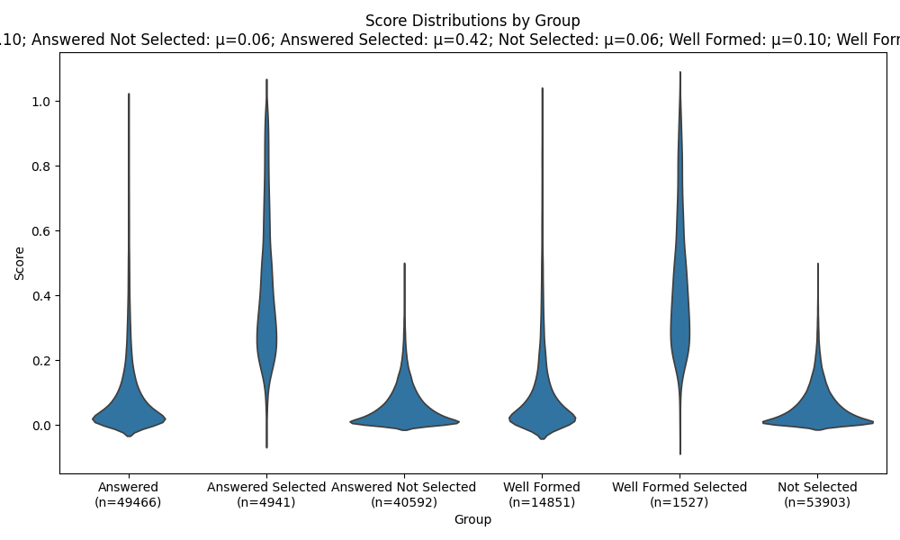

# Binary Relevance -> Helpfulness

> It's LLMs all the way down.

## Motivation
I wanted a playground for probing language models as raters and to understand how capability
has evolved in the past few years. I also wanted to track the performance of different approaches I've come
across.

A few areas I'm exploring:
- Essential metrics such as precision, recall, f1 score, Cohen's kappa.
- Understanding biases or preference asymmetries and how to mitigate them.
- How well do language models use the full rating distribution?
- How do prompting strategies (prompt engineering, zero-shot, few-shot) compare with SFT?
- How does the model training objective (masked/denoising vs autoregressive) relate to performance?
- How reliable are autoregressive models at generating structured output (JSON)?

## Eval Framing
I want to go beyond basic relevance tests of “is a document relevant or not with respect 
to a query” and consider how useful or helpful it is based on the query’s user need. A 
document that fully and succinctly meets the user’s information needs should be preferred 
to one that rambles on about many topics. That said, there are also user needs that cannot 
be satisfied by a single response because many responses would be valid. This could be 
because the information need is underspecified or because there are legitimately multiple 
equally correct answers.

### Rating Guidelines:
- **3 (Fully Meets):** the document fully and unambiguously meets the user need.  
  - Query: *What is the capital of France?*  
    Answer: *Paris*

- **2 (Meets):** the document meets the user need, but there are other equally good answers.  
  - Query: *Quarterly report*  
    Answer: *2025 Q2 Quarterly Report, 2025 Q1 Quarterly Report*

- **1 (Related):** the document is related to the query, but does not directly address the information need.  
  - Query: *Quarterly report*  
    Answer: *2024 Annual Report, 2025 Q2 Budget Doc*

- **0 (Off-topic):** the document does not seem relevant to the query at all, even if some terms overlap.  
  - Query: *Quarterly report*  
    Answer: *Employee Holiday Party Agenda*  
  - Query: *Python pandas rolling volatility*  
    Answer: *Panda conservation efforts in China*


## Ground Truth
There are [many](https://github.com/ad-freiburg/large-qa-datasets) questions / answer
datasets to choose from, but none are labeled to reflect relevance and helpfulness of
responses. The closest might be [MS MARCO v2.1](https://huggingface.co/datasets/microsoft/ms_marco)
which includes a query, a list of passages retrieved using BM25 from an inverted index,
a selected 'best' passage, a human written summary that extracts from the passages, and
a wellFormedAnswer, which is a human rewrite of the answer. The answer and wellFormedAnswer
are both optional. If there is no selected passage, the answer field will simply say
"No Answer Present."

Let's look at an example:

```json
{
    "query_id": 524762,
    "query": "triglycerides what are they",
    "answers": ["A triglyceride is an ester derived from glycerol and three to four fatty acids."],
    "wellFormedAnswers": []
}
```

And the `passage_text`, which includes the `is_selected` vector:
```json
{
"is_selected": [ 1, 0, 0, 0, 0, 0, 0, 0, 0, 0 ],
"passage_text": [
"A triglyceride is an ester derived from glycerol and three to four fatty acids. Triglycerides are the main constituents of body fat in humans and other animals, as well as vegetable fat. They are also present in the blood to enable the bidirectional transference of adipose fat and blood glucose from the liver, and are a major component of human skin oils. There are many different types of triglyceride, with the main division between saturated and unsaturated types. Saturated fats are saturated",
"A triglyceride (TG, triacylglycerol, TAG, or triacylglyceride) is an ester derived from glycerol and three to four fatty acids (from tri-and glyceride). Triglycerides are the main constituents of body fat in humans and other animals, as well as vegetable fat. They are also present in the blood to enable the bidirectional transference of adipose fat and blood glucose from the liver, and are a major component of human skin oils.",
"For adults, triglyceride test results are categorized as follows: 1 Desirable: Less than 150 mg/dL (1.7 mmol/L) 2 Borderline high: 150 to 199 mg/dL (1.7-2.2 mmol/L) 3 High: 200 to 499 mg/dL (2.3-5.6 mmol/L) 4 Very high: Greater than 500 mg/dL (5.6 mmol/L)",
"Triglycerides. 1 Blood tests for triglycerides are usually part of a lipid profile that is used to help identify an individual's risk of developing heart disease and to help make decisions about what treatment may be needed if there is borderline or high risk.",
"Testing may be ordered more frequently when people have identified risk factors for heart disease. 1 Some risk factors for heart disease include: 2 Cigarette smoking. 3 Being overweight or obese. 4 Unhealthy diet. 5 Being physically inactive—not getting enough exercise. 6 Age (men 45 years or older or women 55 years or older)",
"Ranges with anything over 499 are being considered extremely high. But these numbers serve more as just a measurement method. They are used to assess risk. Most people wondering what are triglycerides also want to know what having elevated triglycerides levels can mean for the body. Atherosclerosis is the biggest risk associated with having high triglycerides levels.",
"Sometimes, this storage comes in the form of excess fat in the midsection. Figuring out just what are triglycerides means understanding where they come from. In most cases, triglycerides are the result of digestion and the body breaking down fats. Sometimes they also are the byproduct of carbohydrates as well. While the fats are not always a bad thing, having triglycerides too high can be and for a multitude of reasons.",
"What Are Triglycerides Levels and Why Do They Matter? When most people ask what are triglycerides, it is because they associate the word with being bad for the body. In fact, they are incredibly important to many body processes and are considered the main form of fat within the body. The body uses triglycerides for energy, which is a good thing.",
"A triglyceride (TG, triacylglycerol, TAG, or triacylglyceride) is an ester derived from glycerol and three fatty acids (from tri- and glyceride). Triglycerides are the main constituents of body fat in humans and other animals, as well as vegetable fat. They are also present in the blood to enable the bidirectional transference of adipose fat and blood glucose from the liver, and are a major component of human skin oils.",
"Triglycerides are utilized in the body by offering a source of energy to cells that require it. They are a normal component of the blood and are naturally stored in fat deposits. However, when present in excess triglycerides can cause problems in the body and lead to serious diseases."
]
}
```

The answer text appears directly pulled from the first `passage_text`, which is the selected
passage for the query. But there are many possible answers to the query "what are triglycerides"
and I would rate the selected passage as 2. It is relevant, helpful, but non-unique.


Let's contrast that with another example query: [what county is nine mile in]

```json
{
    "answer": [ "Onondaga" ],
    "wellFormedAnswers": ["Nine Mile is in Onondaga county."],
    "passages['passage_text'][1]": "Ninemile Creek is located in Onondaga County near the towns of Camillus. and Marcellus. There are 5 miles of Public Fishing Rights (PFR’s) along this. medium sized mostly open stream. Ninemile Creek is a popular fly fishing. location. Both wild brown trout and the occasional wild brook trout are found. in the stream.The stream is also stocked annually by Onondaga County’s."
}
```

In this case, I would rate this selected passage as a 3. It is relevant, helpful, and
completely satisfies the user's information need.

I considered 30 other examples and landed at this heuristic for query / doc scoring:
    - answers and *1 or more* wellFormedAnswers -> selected passage text is 3
    - answers and *0* wellFormedAnswers -> 3 if passage has strong entailment, otherwise 2
    - no answers and no selected answers -> 1 with high cosine similarity between query / doc, 0 otherwise

programmatically:
```
    query, answer, wellFormed, passage := MS MARCO:
    if answers:
        return 3 if nli(answer, passage) > 0.7 else 2
    if not answers and not wellFormedAnswers:
        return 1 if nil(query, passage) > 0.35 else 0
```

## Analysis of MS MARCO answer / passage entailment
I [analyzed](notebooks/msmarco_relevance.ipynb) MS MARCO v2.1 by calculating an entailment
score between the answer and passages.

| Group                  | Count  | Median  | Mean    | Std Dev  |
|-------------------------|--------|---------|---------|----------|
| Answered               | 45,533 | 0.0486  | 0.1002  | 0.1457   |
| Answered Not Selected  | 40,592 | 0.0400  | 0.0609  | 0.0637   |
| Answered Selected       | 4,941 | 0.3674  | 0.4224  | 0.2140   |
| Not Selected           | 53,903 | 0.0398  | 0.0612  | 0.0647   |
| Well Formed            | 14,838 | 0.0477  | 0.1004  | 0.1449   |
| Well Formed Selected    | 1,527 | 0.3914  | 0.4343  | 0.1999   |



Having both answered and well formed answer improves the entailment slightly,
the differnce is not statistically significant. I set the score cutoff
for 

